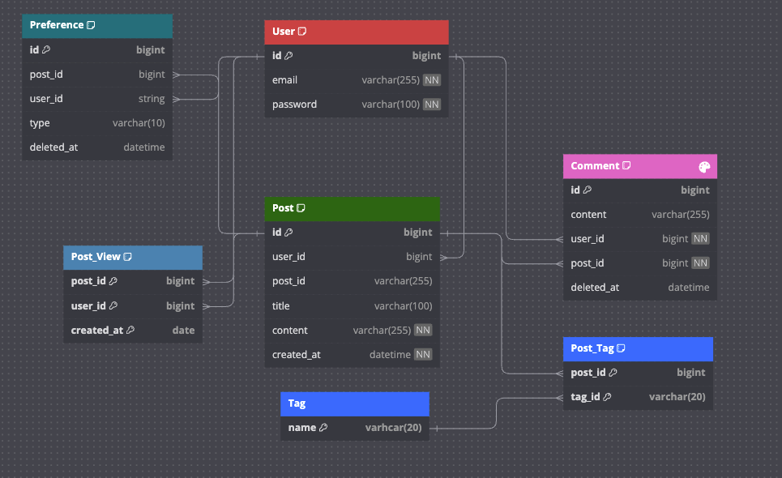

# nts-이승환


 


### 실행방법

```shell
docker-compose up -d
```

### 접속방법

```shell
http://localhost
```

### [DB 스키마](./DB_Schema.md)

#### [ERD 페이지](https://dbdiagram.io/d/6572df2356d8064ca0a3ad9c)


#### [기능 시연 화면](./execute.md)
